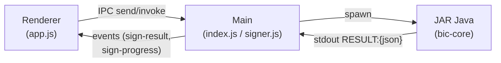
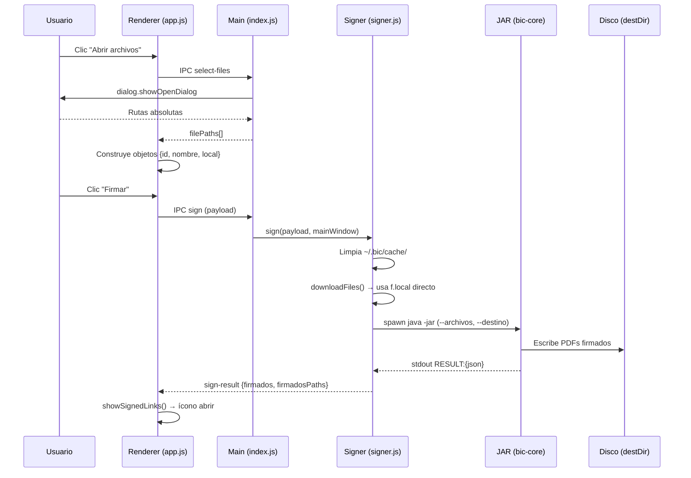
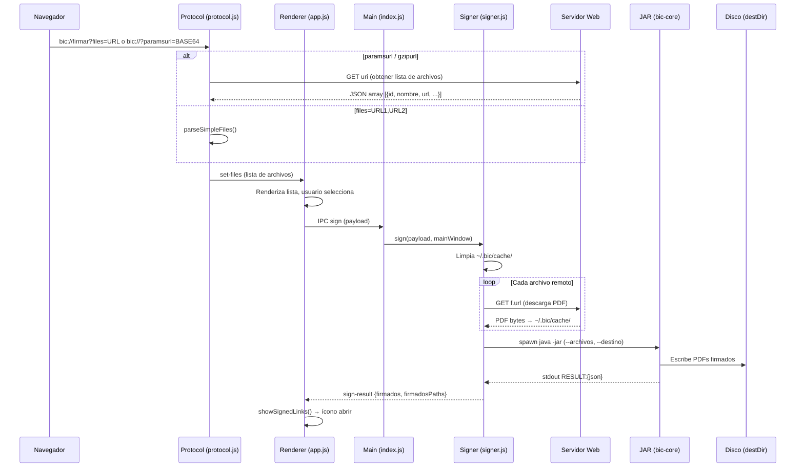
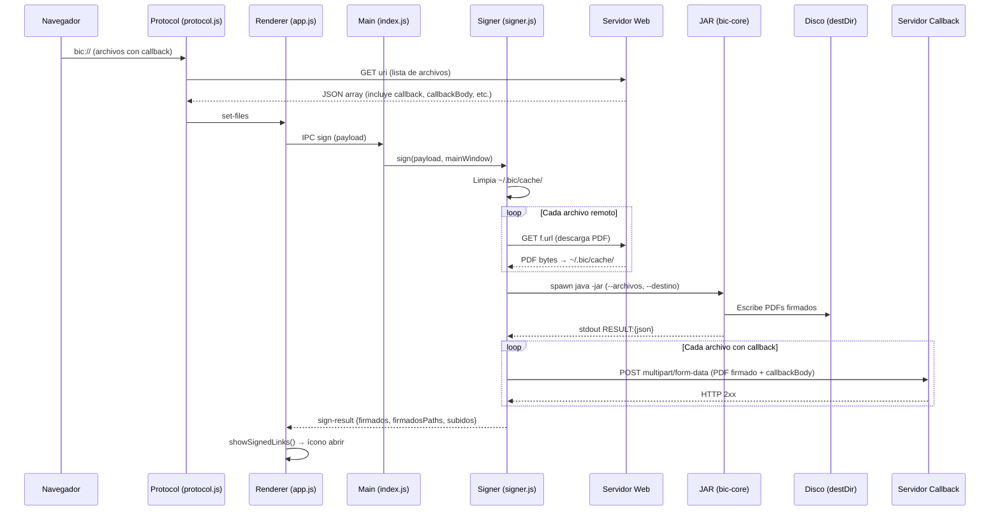

# Flujos de Firma — Documentación Técnica

BiC soporta tres modalidades de firma de documentos PDF. Todas comparten el mismo pipeline central (`signer.js → JAR Java`) pero difieren en cómo se obtienen los archivos de entrada y qué ocurre con los archivos firmados de salida.

---

## Arquitectura general



- **Renderer** (`app/renderer/app.js`): UI, recopila archivos y configuración, envía `sign` via IPC.
- **Main** (`app/main/index.js`): orquesta IPC, resuelve imagen de firma del perfil activo.
- **Signer** (`app/main/signer.js`): descarga, invoca el JAR, sube resultados.
- **Protocol** (`app/main/protocol.js`): parsea URLs `bic://` y entrega la lista de archivos al renderer.
- **JAR** (`core/`): firma PDF con iText, devuelve resultado en stdout como `RESULT:{json}`.

---

## 1. Firma de archivos locales

El usuario selecciona PDFs desde su sistema de archivos mediante el diálogo nativo de Electron.

### Detalle paso a paso

1. **Selección**: `openFilesBtn` dispara `window.bic.selectFiles()` → IPC `select-files` → `dialog.showOpenDialog` con filtro PDF.
2. **Construcción del objeto archivo**:
   ```js
   { id: rutaAbsoluta, nombre: "archivo.pdf", local: rutaAbsoluta }
   ```
   - `id` y `local` son la ruta completa del archivo en disco.
   - No tiene `url` ni `callback`.
3. **Firma**: el renderer envía el payload via `ipcRenderer.send('sign', payload)`.
4. **En signer.js**:
   - Se limpia `~/.bic/cache/`.
   - `downloadFiles()` detecta `f.local` y usa la ruta directamente (sin descarga).
   - Se construyen los argumentos del JAR con `--archivos=ruta1,ruta2` y `--destino=dirSalida`.
   - El JAR firma y escribe los PDFs en `destDir` con el mismo nombre del archivo original.
5. **Resultado**: se envía `sign-result` al renderer con `firmados` (nombres), `firmadosDir` y `firmadosPaths` (rutas absolutas).
6. **UI**: `showSignedLinks()` agrega un ícono de descarga (abrir con app del sistema) en cada fila del archivo firmado.

### Diagrama



---

## 2. Firma de archivos descargados (remotos sin callback)

Una aplicación web invoca el protocolo `bic://` con URLs de archivos PDF. BiC los descarga, firma y guarda localmente. No hay upload de vuelta.

### Detalle paso a paso

1. **Invocación**: el navegador abre `bic://firmar?files=https://ejemplo.com/doc.pdf` o `bic://?paramsurl=BASE64`.
2. **Protocol** (`protocol.js`):
   - Normaliza la URL `bic://` a una URL parseable.
   - Si tiene `files=`, parsea como lista separada por comas → `parseSimpleFiles()`.
   - Si tiene `paramsurl` o `gzipurl`, decodifica Base64 (opcionalmente gzip), obtiene `{ uri, headers }`, hace GET al `uri` para obtener un JSON array con la lista de archivos → `fetchFileList()`.
3. **Objeto archivo** (remoto sin callback):
   ```js
   { id: uuid, nombre: "doc.pdf", url: "https://...", urlHeaders: {...} }
   ```
   - No tiene `local` ni `callback`.
4. **Envío al renderer**: `sendToRenderer()` envía `set-files` via `webContents.send`.
5. **Firma**: igual que el flujo local, pero en `downloadFiles()`:
   - Detecta que no tiene `f.local` → descarga el PDF desde `f.url` a `~/.bic/cache/`.
   - El resto del pipeline es idéntico.
6. **Sin upload**: `files.filter(f => f.callback)` resulta vacío → no se sube nada.
7. **Resultado**: los archivos firmados quedan en `destDir` y se muestran los íconos para abrirlos.

### Diagrama



---

## 3. Firma de archivos descargados y subidos (remotos con callback)

Igual que el flujo 2, pero cada archivo incluye un `callback` URL. Después de firmar, BiC sube el PDF firmado de vuelta al servidor.

### Detalle paso a paso

1. **Invocación**: idéntica al flujo 2. La diferencia está en el JSON de archivos que incluye campos adicionales:
   ```json
   {
     "id": "abc-123",
     "nombre": "documento.pdf",
     "url": "https://servidor/descargar/documento.pdf",
     "urlHeaders": { "Authorization": "Bearer ..." },
     "callback": "https://servidor/subir",
     "callbackMethod": "POST",
     "callbackHeaders": { "Authorization": "Bearer ..." },
     "callbackBody": { "expedienteId": "456" },
     "callbackAtributo": "archivo"
   }
   ```
2. **Descarga y firma**: idéntico al flujo 2.
3. **Upload** (paso 4 en `signer.js`):
   - Filtra archivos con `f.callback`.
   - Para cada uno, construye un `FormData` con:
     - Los campos de `callbackBody` como parámetros del form.
     - El archivo firmado como campo file (nombre del atributo: `callbackAtributo` o `"file"`).
   - Envía la petición HTTP(S) al `callback` con el método indicado (`callbackMethod` o `POST`).
   - Registra los IDs subidos exitosamente en `subidos[]`.
4. **Resultado**: `sign-result` incluye `subidos` con los IDs de archivos que se subieron correctamente.

### Diagrama



---

## Resumen comparativo

| Aspecto              | Local                    | Descargado               | Descargado + Subido         |
|----------------------|--------------------------|--------------------------|-----------------------------|
| Origen de archivos   | `dialog.showOpenDialog`  | URL via `bic://`         | URL via `bic://`            |
| Propiedad `local`    | ruta absoluta            | —                        | —                           |
| Propiedad `url`      | —                        | URL del PDF              | URL del PDF                 |
| Propiedad `callback` | —                        | —                        | URL de upload               |
| Descarga a caché     | No                       | Sí (`~/.bic/cache/`)     | Sí (`~/.bic/cache/`)        |
| Firma (JAR)          | Sí                       | Sí                       | Sí                          |
| Salida               | `destDir`                | `destDir`                | `destDir` + upload callback |
| Upload post-firma    | No                       | No                       | Sí (multipart/form-data)    |

---

## Directorios del sistema

| Directorio              | Propósito                                      |
|-------------------------|-------------------------------------------------|
| `~/.bic/cache/`         | PDFs descargados temporalmente (se limpia antes de cada firma) |
| `~/.bic/firmados/`      | Directorio de salida por defecto                |
| `~/.bic/`               | Configuración, imágenes de firma, logs          |
| `~/.bic/logs/`          | Logs de crash y operaciones                     |
